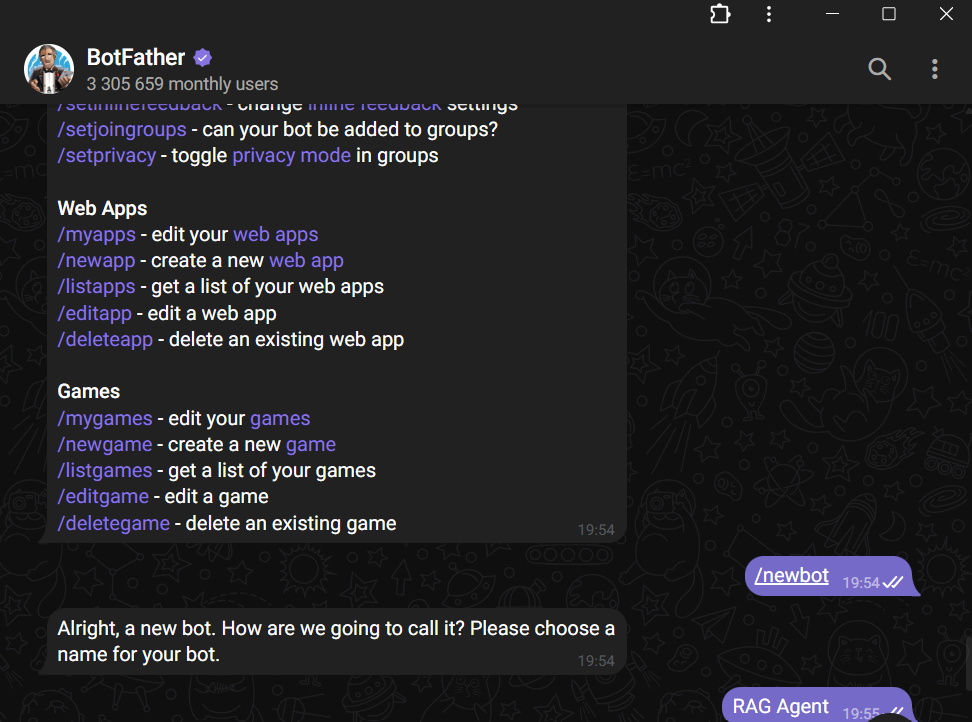
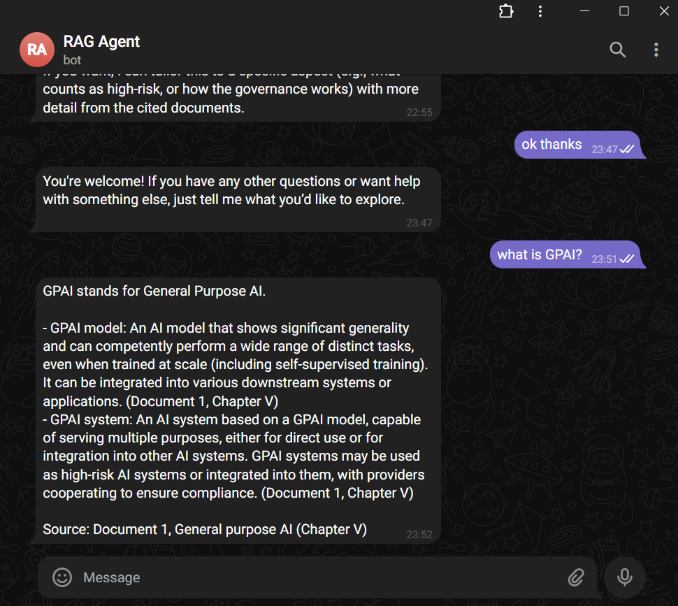

# Customizable RAG Agent with Telegram Bot Frontend


## 📌 Project Overview

This project is a **customizable Retrieval-Augmented Generation (RAG) agent** built using **LangGraph, ChromaDB, and OpenAI models**, with **Telegram Bot** serving as the chat frontend. The agent indexes PDF documents, stores embeddings in a vector database, and retrieves relevant chunks to answer user queries conversationally.

> ✅ Features:
>
> * Modular RAG architecture using **LangGraph**
> * **Pluggable PDF knowledge base** using Chroma
> * **Telegram bot integration** for real-time interaction
> * Configurable system prompt via **Jinja2 template**
> * Ready for deployment and extensibility

---

## 📂 Project Structure

```
project_root/
│       
├── .gitignore  
├── config.py                    # Configuration variables (API keys, paths, models)
├── .env                         # Private environment variables
├── README.md                    # Project documentation
├── pyproject.toml               # Project dependencies 
│
├── knowledge_base/              # Folder with PDF files for ingestion
│
├── app/
│   ├── RAG_agent.py             # Core RAG logic and LangGraph setup
│   ├── telegram_bot.py          # Telegram bot frontend integration
│   ├── __init__.py              # Makes app a module
│
├── vectorstore/                 # Persisted ChromaDB embeddings
│               
├── prompts/                     # Folder with system prompts in j2 format
│   ├── ...
│
├── examples/                      # For README file pictures
│   ├── ...
```

---

## 🚀 Installation & Setup

### 1. **Install Dependencies Using `uv`**

Make sure `uv` (package manager) is installed.
if not 
```bash
pip install uv
```
then
```bash
uv sync
```

### 2. **Environment Variables (`.env`) set up**

Create a `.env` file in the **project_root/** directory based on .env.example and fill API keys. 
In order to get Telegram token, find and interact with BotFather via telegram (see below).


### 3. **Creating knowledge database**

Save as many PDF files as you need in the knowledge_base\ folder

---

## ▶️ Running the RAG Agent with Telegram Bot

1. **Ensure Chroma Vectorstore Exists** (first run will generate it automatically)
2. Start the bot:

```bash
python -m app.telegram_bot
```

3. Open Telegram and send a message to your bot configured before→ **Start chatting!**



---

## 📌 Notes & Best Practices

* Add PDFs to `knowledge_base/` before running the agent
* Use `Jinja2` templates to modify system behavior without editing Python code
* Telegram messages are limited to **4096 characters**, therefore, agent will summarize the answer to thi length
* Extend the agent by adding more tools or external data sources

---
